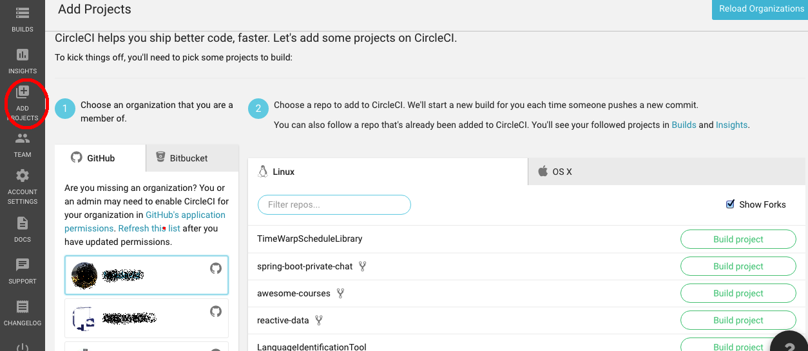
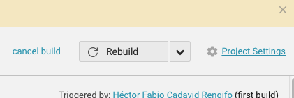
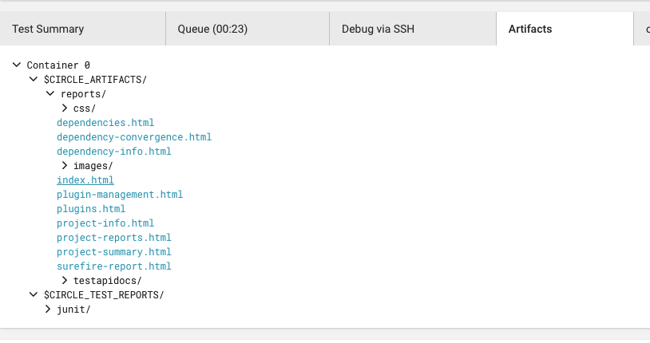

## Integración contínua con CircleCI y Heroku

[Documentación CircleCI para Heroku:](https://circleci.com/docs/continuous-deployment-with-heroku)

### Parte I.

1. Integre las capas lógicas (lab 6) y de presentación (lab5) - ver enunciado anterior-

### Parte II.

1. Cree (si no la tiene aún) una cuenta en el proveedor PAAS Heroku ([www.heroku.com](www.heroku.com)).
2. Acceda a su cuenta en Heroku y cree una nueva aplicación:

	

3. Después de crear su cuenta en Heroku y la respectiva aplicación, genere una llave de API: Opción Manage Account:

	
	
	Opción API Key:
	

4. Ingrese a la plataforma de integración contínua Circle.CI ([www.circleci.com](www.circleci.com)). Para ingresar, basta que se autentique con su usuario de GitHUB.
5. Seleccione la opción de agregar proyectos. En la organización o usuario de GitHub, seleccione el proyecto al que le va hacer despliegue continuo, y haga clic en "Build Project":

	 

	Una vez se inicie la primera construcción del proyecto, seleccione las opciones del proyecto (project settings)

	:

	Vaya a CONTINUOUS DEPLOYMENT/Heroku Deployment, y realice los dos pasos indicados: (1) registrar la llave de Heroku, y (2) asociar su usuario para el despliegue:

	


8. Si todo queda correctamente configurado, cada vez que hagan un PUSH al repositorio, CircleCI ejecutará la fase de construcción del proyecto. Para que cuando las pruebas pasen automáticamente se despliegue en Heroku, debe definir en el archivo circle.yml (ubicado en la raíz del proyecto):
	* La rama del repositorio de GitHUB que se desplegará en Heroku. o El nombre de la aplicación de Heroku en la que se hará el
despliegue.
	* La ejecución de la fase ‘site’ de Maven, para generar la
documentación de pruebas, cubrimiento de pruebas y análisis estático (cuando las mismas sean habilitadas).

	Ejemplo:
	[https://github.com/PDSW-ECI/base-proyectos/blob/master/circle.yml](https://github.com/PDSW-ECI/base-proyectos/blob/master/circle.yml)


9. Rectifique que en el pom.xml, en la fase de construcción, se tenga el siguiente plugin (es decir, dentro de <build><plugins>):

	```xml
	<!-- Plugin configuration for Heroku compatibility. -->
            <plugin>
                <groupId>org.apache.maven.plugins</groupId>
                <artifactId>maven-dependency-plugin</artifactId>
                <version>2.1</version>
                <executions>
                    <execution>
                        <phase>package</phase>
                        <goals>
                            <goal>copy</goal>
                        </goals>
                        <configuration>
                            <artifactItems>
                                <artifactItem>
                                    <groupId>com.github.jsimone</groupId>
                                    <artifactId>webapp-runner</artifactId>
                                    <version>8.0.30.2</version>
                                    <destFileName>webapp-runner.jar</destFileName>
                                </artifactItem>
                            </artifactItems>

                        </configuration>
                    </execution>

                </executions>
            </plugin>
 	```           
	
	Y la siguiente configuración para la generación de reportes:
	
	```xml	
    <reporting>
        <plugins>
            <plugin>
                <groupId>org.apache.maven.plugins</groupId>
                <artifactId>maven-pmd-plugin</artifactId>
                <version>3.4</version>
            </plugin>
            <plugin>
                <groupId>org.apache.maven.plugins</groupId>
                <artifactId>maven-surefire-report-plugin</artifactId>
                <version>2.18.1</version>
            </plugin>
            <plugin>
                <groupId>org.apache.maven.plugins</groupId>
                <artifactId>maven-javadoc-plugin</artifactId>
                <version>2.10.1</version>
            </plugin>
            <plugin>
                <groupId>org.codehaus.mojo</groupId>
                <artifactId>cobertura-maven-plugin</artifactId>
                <version>2.6</version>
                <configuration>
                    <formats>
                        <format>html</format>
                        <format>xml</format>
                    </formats>
                </configuration>
            </plugin>            
        </plugins>
    </reporting>
 	```	
	
	
	Nota: Si en el pom.xml ya hay otro plugin con el mismo <groupId> y <artifactId>, reemplácelo por el anteriormente mostrado.

10. Heroku requiere los siguientes archivos de configuración (con sus respectivos contenidos) en el directorio raíz del proyecto, de manera que sea qué versión de Java utilizar, y cómo iniciar la aplicación, respectivamente:

	system.properties

	```
	java.runtime.version=1.8
	```

	Procfile 

	```
	web:    java $JAVA_OPTS -jar target/endorsed/webapp-runner.jar --port $PORT target/*.war
	```

10. El ambiente de despliegue contínuo requiere también un archivo de configuración 'circle.yml' en la raíz del proyecto, en el cual se indica (entre otras cosas) en qué aplicación de Heroku se debe desplegar la aplicación que está en GitHUB. Puede basarse en el siguiente archivo, teniendo en cuenta que se debe ajustar el parámetro 'appname': [https://github.com/PDSW-ECI/base-proyectos/blob/master/circle.yml](https://github.com/PDSW-ECI/base-proyectos/blob/master/circle.yml)


6. Haga commit y push de su repositorio local a GitHub. Abra la consola de CircleCI y verifique que el de descarga, compilación, y despliegue. Igualmente, verifique que la aplicación haya sido desplegada en Heroku.

11.Revise los reportes generados tras el despliegue, en la sección "Artifacts":




